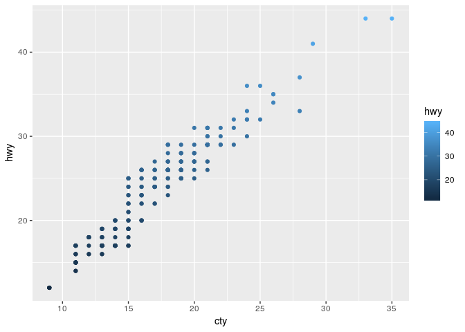
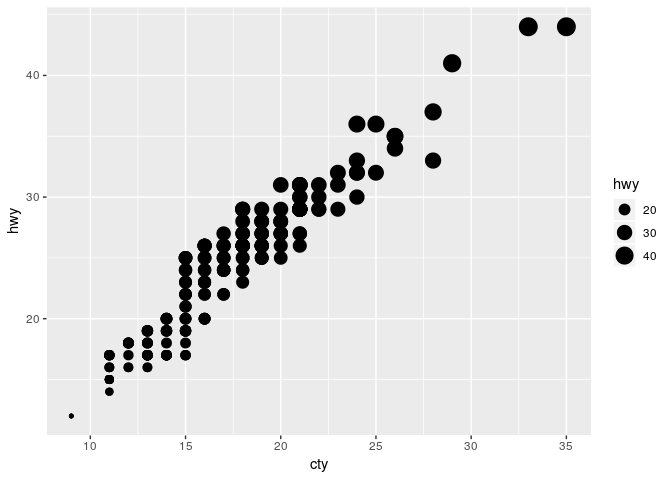
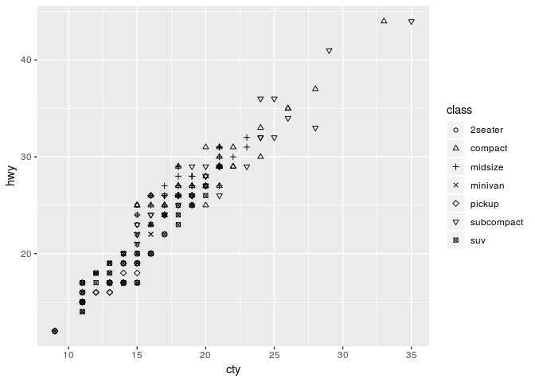
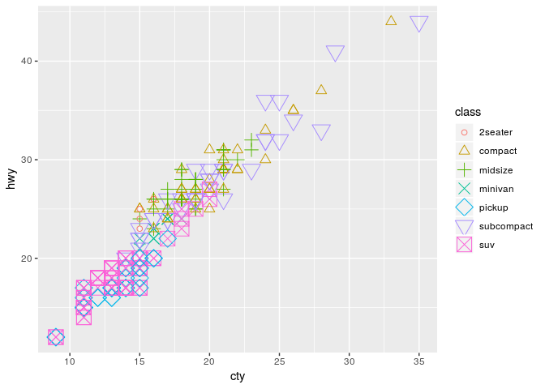
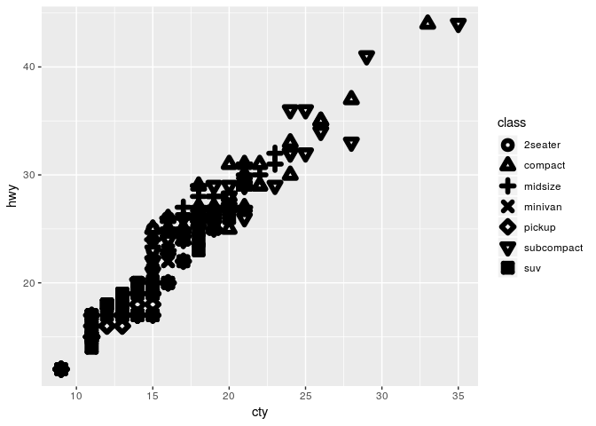
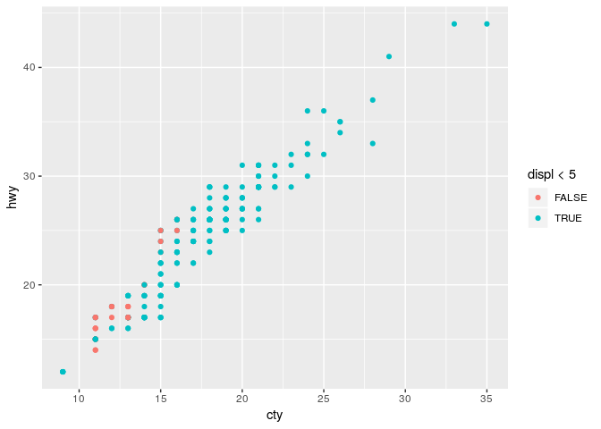

Homework 1: ggplot2
================
Monika Stoljarova
2019-03-04

``` r
library(ggplot2)
```

By using *mpg* dataset:

1.  Map a continuous variable to color, size, and shape. How do these
    aesthetics behave differently for categorical vs. continuous
    variables?

<!-- end list -->

  - Color

<!-- end list -->

``` r
ggplot(data = mpg) + geom_point(mapping = aes(x=cty, y=hwy, color=hwy))
```

<!-- -->

  - Size

<!-- end list -->

``` r
ggplot(data = mpg) + geom_point(mapping = aes(x=cty, y=hwy, size=hwy))
```

<!-- -->

  - Shape

<!-- end list -->

``` r
ggplot(data = mpg) + geom_point(mapping = aes(x=cty, y=hwy, shape=class))+scale_shape_manual(values=1:7)
```

<!-- --> MS: It is not
possible to map shape to a continues variable. At least this is what the
RStudio says.

2.  What happens if you map the same variable to multiple
aesthetics?

<!-- end list -->

``` r
ggplot(data = mpg) + geom_point(mapping = aes(x=cty, y=hwy, color=class, size=class, shape=class)) + scale_shape_manual(values=1:7
                                                                                                                      )
```

    ## Warning: Using size for a discrete variable is not advised.

<!-- --> MS: Each of
the variable point get a different, coclor, size and shape. Very
vibrant.

3.  What does the stroke aesthetic do? What shapes does it work with?
    (Hint: use
?geom\_point)

<!-- end list -->

``` r
ggplot(data = mpg) + geom_point(mapping = aes(x=cty, y=hwy, shape=class), stroke=3)+scale_shape_manual(values=1:7)
```

<!-- --> MS: Stoke
changes the thinkness of shape’s symple wall

4.  What happens if you map an aesthetic to something other than a
    variable name, like aes(colour = displ \<
5)?

<!-- end list -->

``` r
ggplot(data = mpg) + geom_point(mapping = aes(x=cty, y=hwy, color = displ < 5))
```

<!-- --> MS: the
aestetic is applied to the specified value. In our case disp \<5 is
seperataly colored than disp \>=5
